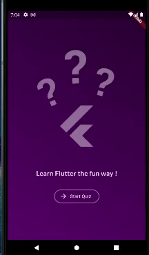

# Quiz App

Pequeno projeto em Flutter feito durante meus estudos de Flutter.

Realizado seguindo o curso "Flutter & Dart - The Complete Guide" do instrutor Maximilian Schwarzmüller e disponibilizado no Udemy.

## Sobre a Aplicação

O projeto consiste em um quiz estático sobre Flutter.

Ao iniciar o quiz, irá passar por todas as questões pré-definidas até chegar na tela de resultados.

## Informações Extras

- Esta aplicação foi testada no Android apenas
- A interface foi baseada na que foi mostrada no curso "Flutter & Dart - The Complete Guide" com ajustes feitos por mim de acordo com minhas preferências
