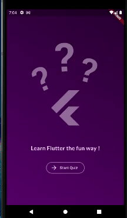

# Quiz App

Small Flutter project done during my Flutter Studies.

Specifically following Maximilian Schwarzmüller course "Flutter & Dart - The Complete Guide" available on Udemy.

## About the Application

This project consists of a static quiz about Flutter.

Which goes through all the pre defined questions and at the end show the results.

## Extra Information

- This application were tested only on Android
- All the interface is based on "Flutter & Dart - The Complete Guide" course, but I did some changes based on my preferences